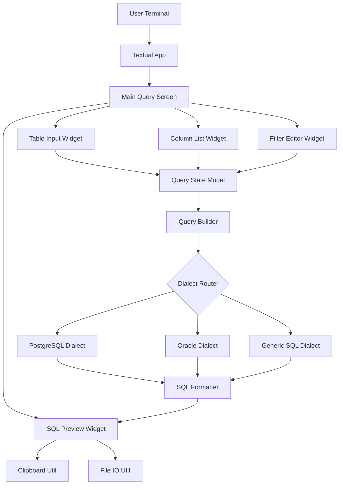

# Design Document - Phase 1: SQL Query Builder

## Overview

Phase 1 implements an interactive terminal-based SQL query builder using Python 3.10+ and the Textual framework. The system follows an MVC architecture with pluggable SQL dialect support, enabling support engineers to construct SELECT queries with WHERE clauses for PostgreSQL, Oracle, and generic SQL through an intuitive keyboard-driven interface.

## Steering Document Alignment

### Technical Standards (tech.md)
- **Python 3.10+**: Leverages modern type hints and language features
- **Textual Framework**: Provides reactive TUI with rich widgets and cross-platform support
- **MVC Architecture**: Separates UI (View), query state (Model), and SQL generation (Controller)
- **Pluggable Dialects**: Base dialect protocol with concrete implementations for each database

### Project Structure (structure.md)
- **Module Organization**: Follows `ui/`, `sql/`, `models/`, `utils/` structure
- **Dependency Rules**: UI → SQL → Models, with Utils as cross-cutting
- **Naming Conventions**: snake_case files, PascalCase classes, type hints required
- **Single Responsibility**: Each module handles one specific concern

## Code Reuse Analysis

Since this is Phase 1, we're establishing the foundation. However, we will structure code for future reuse:

### Foundation Components for Future Reuse
- **BaseDialect Protocol**: Will be extended for JOIN support, INSERT/UPDATE in later phases
- **QueryState Model**: Extensible data structure that can accommodate aggregations, subqueries
- **Validation Utilities**: Reusable across all query types (SELECT, INSERT, UPDATE, DELETE)
- **TUI Widget Library**: Reusable form inputs, lists, and dialogs for future features

### Design for Extension
- Plugin architecture for SQL dialects allows adding MySQL, SQLite without changing core
- Query builder supports method chaining for future fluent API
- Filter model can be extended to support OR conditions, nested predicates

## Architecture

The system uses **MVC with Reactive UI** pattern:

```
User Input → UI Events → Update Models → Generate SQL → Display Preview
     ↑                                                          ↓
     └──────────────── User sees preview ─────────────────────┘
```

### Modular Design Principles
- **Single File Responsibility**: `builder.py` handles query construction, `formatter.py` handles pretty-printing
- **Component Isolation**: Dialects are independent plugins, UI widgets are self-contained
- **Service Layer Separation**:
  - **Presentation**: TUI screens and widgets (`ui/`)
  - **Business Logic**: Query building, validation (`sql/`)
  - **Data Layer**: Models representing query state (`models/`)
- **Utility Modularity**: Clipboard, config, validation are independent utilities

### Architecture Diagram



## Components and Interfaces

### Component 1: Query State Model (`models/query.py`)
- **Purpose**: Represents the current query being built (tables, columns, filters, dialect)
- **Interfaces**:
  - `add_table(name: str) -> None`: Add table to query
  - `add_column(name: str) -> None`: Add column to SELECT
  - `add_filter(filter: Filter) -> None`: Add WHERE condition
  - `set_dialect(dialect: str) -> None`: Set target database
  - `clear() -> None`: Reset query state
- **Dependencies**: None (pure data model)
- **Reuses**: N/A (foundation component)

### Component 2: Filter Model (`models/filters.py`)
- **Purpose**: Represents a single WHERE clause condition
- **Interfaces**:
  - `__init__(column: str, operator: str, value: Any)`
  - `to_sql(dialect: BaseDialect) -> str`: Generate SQL for this filter
  - `validate() -> bool`: Ensure filter is valid
- **Dependencies**: None
- **Reuses**: N/A (foundation component)

### Component 3: Schema Model (`models/schema.py`)
- **Purpose**: Represents table and column metadata
- **Interfaces**:
  - `Table(name: str, columns: List[Column])`
  - `Column(name: str, data_type: Optional[str])`
- **Dependencies**: None
- **Reuses**: N/A (foundation for future schema discovery)

### Component 4: Base Dialect Protocol (`sql/dialects/base.py`)
- **Purpose**: Define interface that all SQL dialects must implement
- **Interfaces** (Protocol):
  - `quote_identifier(name: str) -> str`: Escape table/column names
  - `format_string_literal(value: str) -> str`: Escape string values
  - `format_number_literal(value: Union[int, float]) -> str`: Format numbers
  - `get_null_keyword() -> str`: Return NULL keyword
  - `supports_feature(feature: str) -> bool`: Check dialect capabilities
- **Dependencies**: None
- **Reuses**: N/A (base protocol)

### Component 5: Concrete Dialects (`sql/dialects/postgresql.py`, `oracle.py`, `generic.py`)
- **Purpose**: Implement dialect-specific SQL generation
- **Interfaces**: Implements `BaseDialect` protocol
- **Dependencies**: `BaseDialect` protocol
- **Reuses**: Base protocol ensures consistent interface
- **Example**:
  - PostgreSQL: `"table_name"` for identifiers, `$$` for dollar-quoted strings
  - Oracle: `"table_name"` for case-sensitive, `'string'` for literals
  - Generic: Conservative ANSI SQL, no advanced features

### Component 6: Query Builder (`sql/builder.py`)
- **Purpose**: Orchestrates SQL generation from query state
- **Interfaces**:
  - `__init__(state: QueryState, dialect: BaseDialect)`
  - `build_select() -> str`: Generate SELECT clause
  - `build_from() -> str`: Generate FROM clause
  - `build_where() -> str`: Generate WHERE clause
  - `build_query() -> str`: Generate complete SQL query
- **Dependencies**: `QueryState`, `BaseDialect`
- **Reuses**: Dialect protocol for database-specific syntax

### Component 7: SQL Formatter (`sql/formatter.py`)
- **Purpose**: Pretty-print SQL with indentation and syntax highlighting
- **Interfaces**:
  - `format(sql: str, style: str = 'default') -> str`: Format SQL string
  - `highlight(sql: str) -> RichText`: Add syntax highlighting for terminal
- **Dependencies**: Rich library for styling
- **Reuses**: Standard SQL formatting conventions

### Component 8: Validation Utilities (`utils/validation.py`)
- **Purpose**: Validate user inputs (identifiers, values, operators)
- **Interfaces**:
  - `validate_identifier(name: str) -> Tuple[bool, str]`: Check if valid SQL identifier
  - `validate_operator(op: str) -> bool`: Check if valid SQL operator
  - `validate_value(value: str, value_type: str) -> Tuple[bool, Any, str]`: Parse and validate filter values
  - `is_sql_keyword(name: str) -> bool`: Check if reserved keyword
- **Dependencies**: None
- **Reuses**: N/A (foundation utility)

### Component 9: Clipboard Utility (`utils/clipboard.py`)
- **Purpose**: Cross-platform clipboard operations
- **Interfaces**:
  - `copy_to_clipboard(text: str) -> bool`: Copy SQL to clipboard
  - `is_clipboard_available() -> bool`: Check if clipboard is accessible
- **Dependencies**: `pyperclip` library
- **Reuses**: Standard clipboard library

### Component 10: Main TUI Application (`ui/app.py`)
- **Purpose**: Textual app entry point and main screen orchestration
- **Interfaces**:
  - `compose() -> ComposeResult`: Define UI layout
  - `on_mount() -> None`: Initialize application state
  - `action_*() -> None`: Handle keyboard shortcuts
- **Dependencies**: Textual framework, all other components
- **Reuses**: Textual's app structure and reactive system

### Component 11: Query Builder Screen (`ui/screens/query_builder.py`)
- **Purpose**: Main UI screen with all query building widgets
- **Interfaces**:
  - `compose() -> ComposeResult`: Layout widgets
  - `on_table_changed(event) -> None`: Handle table selection
  - `on_column_added(event) -> None`: Handle column additions
  - `on_filter_added(event) -> None`: Handle filter additions
  - `update_preview() -> None`: Refresh SQL preview
- **Dependencies**: All UI widgets, `QueryState`, `QueryBuilder`
- **Reuses**: Textual screen and widget system

### Component 12: UI Widgets (`ui/widgets/`)
- **Purpose**: Reusable UI components for inputs and displays
- **Widgets**:
  - `TableInput`: Input field for table name with validation
  - `ColumnList`: Scrollable list of selected columns with add/remove
  - `FilterEditor`: Form for creating/editing WHERE conditions
  - `SQLPreview`: Read-only syntax-highlighted SQL display
  - `DialectSelector`: Radio buttons for database selection
- **Dependencies**: Textual widgets, validation utilities
- **Reuses**: Textual's built-in widgets (Input, Button, Static, Select)

## Data Models

### QueryState Model
```python
@dataclass
class QueryState:
    """Represents the current query being constructed."""
    table: Optional[str] = None
    columns: List[str] = field(default_factory=list)
    filters: List[Filter] = field(default_factory=list)
    dialect: str = 'generic'

    def to_dict(self) -> dict:
        """Serialize to dictionary."""

    @classmethod
    def from_dict(cls, data: dict) -> 'QueryState':
        """Deserialize from dictionary."""
```

### Filter Model
```python
@dataclass
class Filter:
    """Represents a WHERE clause condition."""
    column: str
    operator: str  # '=', '!=', '<', '>', '<=', '>=', 'LIKE', 'IN', 'IS NULL', 'IS NOT NULL'
    value: Optional[Any] = None  # None for IS NULL/IS NOT NULL

    def to_sql(self, dialect: BaseDialect) -> str:
        """Generate SQL condition string."""

    def validate(self) -> Tuple[bool, str]:
        """Validate filter is well-formed."""
```

### Table and Column Models
```python
@dataclass
class Column:
    """Represents a table column."""
    name: str
    data_type: Optional[str] = None  # For future schema discovery

@dataclass
class Table:
    """Represents a database table."""
    name: str
    columns: List[Column] = field(default_factory=list)
```

## Error Handling

### Error Scenarios

1. **Invalid Identifier Names**
   - **Handling**: Validate before accepting input, show inline error message
   - **User Impact**: User sees "Invalid table name: contains special characters" and can correct immediately

2. **SQL Generation Failures**
   - **Handling**: Catch exceptions in builder, display friendly error in UI
   - **User Impact**: User sees "Unable to generate SQL: missing table name" instead of crash

3. **Clipboard Access Denied**
   - **Handling**: Gracefully fall back to file save option, show warning
   - **User Impact**: User sees "Clipboard unavailable, use Save to File instead"

4. **Invalid Filter Values**
   - **Handling**: Validate value format (number, string, list) before adding filter
   - **User Impact**: User sees "Invalid value for IN operator: expected comma-separated list"

5. **Unsupported Dialect Features**
   - **Handling**: Check dialect capabilities before generating SQL
   - **User Impact**: User sees "Feature X not supported in Oracle dialect"

### Error Handling Strategy
- **Validation at Input**: Prevent invalid data from entering the system
- **Graceful Degradation**: If optional feature fails (clipboard), offer alternative (file save)
- **User-Friendly Messages**: Never show stack traces in UI, log technical details to file
- **Recovery Mechanisms**: Allow user to fix errors without losing current work

## Testing Strategy

### Unit Testing

**Models** (`tests/unit/test_models.py`):
- Test `QueryState` serialization/deserialization
- Test `Filter.to_sql()` with various operators
- Test `Filter.validate()` edge cases

**Dialects** (`tests/unit/test_dialects.py`):
- Test each dialect's identifier quoting
- Test string literal escaping (including SQL injection attempts)
- Test number formatting
- Test NULL handling

**Query Builder** (`tests/unit/test_builder.py`):
- Test SELECT clause generation
- Test WHERE clause generation with multiple filters
- Test complete query generation for each dialect
- Test error handling for missing required fields

**Validation** (`tests/unit/test_validation.py`):
- Test identifier validation (valid/invalid names, keywords)
- Test operator validation
- Test value validation for each data type
- Test SQL injection prevention

### Integration Testing

**UI Flow** (`tests/integration/test_ui_flow.py`):
- Test complete query building flow from start to finish
- Test dialect switching mid-session
- Test clipboard and file export operations
- Test error handling in UI context

**Dialect Integration** (`tests/integration/test_dialect_integration.py`):
- Test query generation with real-world scenarios for each dialect
- Test complex WHERE clauses with multiple filter types
- Test edge cases (special characters, keywords as identifiers)

### End-to-End Testing

**User Scenarios** (`tests/e2e/test_scenarios.py`):
- Scenario 1: Build simple SELECT with 3 columns and 1 filter
- Scenario 2: Build complex query with multiple filters (AND conditions)
- Scenario 3: Switch dialects and verify SQL regeneration
- Scenario 4: Handle invalid inputs and recover
- Scenario 5: Export SQL via clipboard and file

### Test Data
- Sample table names: `customers`, `orders`, `order_items`
- Sample columns: `id`, `name`, `email`, `created_at`, `amount`
- Sample filters: Various operators with different value types
- Edge cases: SQL keywords as identifiers, special characters, empty values

## Implementation Phases

### Phase 1A: Core Models and Validation (Foundation)
- Implement `QueryState`, `Filter`, `Table`, `Column` models
- Implement validation utilities
- Write comprehensive unit tests
- **No UI yet** - test models independently

### Phase 1B: SQL Generation (Business Logic)
- Implement `BaseDialect` protocol
- Implement PostgreSQL, Oracle, Generic dialects
- Implement `QueryBuilder`
- Implement `SQLFormatter`
- Write dialect and builder tests

### Phase 1C: TUI Application (User Interface)
- Implement main Textual app structure
- Implement query builder screen
- Implement UI widgets (TableInput, ColumnList, FilterEditor, SQLPreview)
- Integrate with models and builder
- Test UI flows

### Phase 1D: Utilities and Export (Polish)
- Implement clipboard utility
- Implement file save functionality
- Add configuration loading
- Add keyboard shortcuts and help system
- Integration and E2E testing

### Phase 1E: Packaging and Distribution
- Create `pyproject.toml` and `setup.py`
- Set up PyInstaller for standalone executable
- Write user documentation
- Create example queries and usage guide
