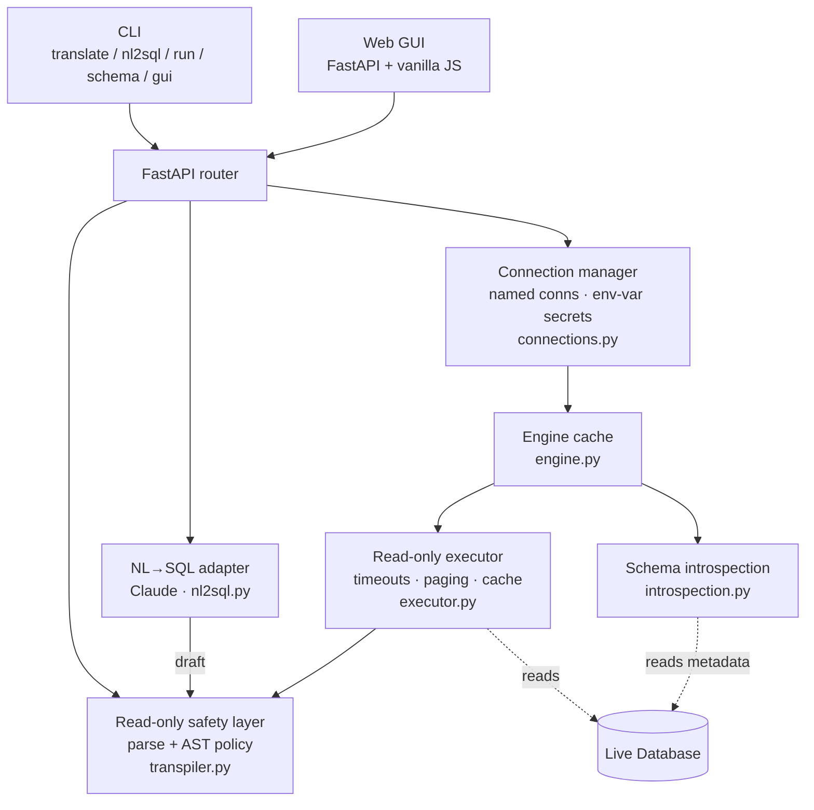

# SQLTrans — System Design & Architecture

**Status:** Current architecture
**Last updated:** 2026-08-13

---

## 1. Overview

SQLTrans is a SQL tool for customer-support engineers with three connected
capabilities, all built on one backbone:

1. **Transpile** SQL between dialects (Oracle ↔ Postgres ↔ MySQL ↔ T-SQL ↔ …).
2. **Generate** SQL from a natural-language request (Claude), schema-aware.
3. **Execute** validated, read-only SQL against a live database and return rows.

The backbone is a **read-only safety policy enforced on the parsed AST** (built
on [sqlglot](https://github.com/tobymao/sqlglot)). Every SQL string the system
produces or runs is parsed and policy-checked before it reaches the user or the
database. The LLM's output is treated as untrusted and validated exactly like
any other input.

The product is surfaced through a **CLI** (`translate` / `nl2sql` / `run` /
`schema` / `gui`) and a **web GUI** (Translate / Ask / Run / Schema).

### Goals

- **Real dialect conversion.** `NVL`→`COALESCE`, `SYSDATE`→`CURRENT_TIMESTAMP`,
  and the long tail of syntax sqlglot handles.
- **Natural-language → SQL.** Claude drafts; the AST policy gates. Schema-aware
  when a live connection is supplied.
- **Safe by construction.** Read-only enforcement on the AST, never on text.
  Multi-statement injection, `SELECT ... INTO`, and all write/DDL/DCL/TCL are
  rejected before conversion or execution.
- **Practical for support engineers.** Connect to real DBs, introspect schema,
  run read-only queries, and see results.

### Non-goals

- Write-path support (`INSERT`/`UPDATE`/`DELETE`/DDL). The read-only policy is a
  product boundary.
- Replacing the LLM with a deterministic generator — the value is the model's
  flexibility, contained by the safety layer.

---

## 2. Architecture



**Every path that produces or runs SQL passes through the safety layer exactly
once, on a parsed AST.** Connection URLs may contain credentials, so they are
never logged.

---

## 3. Read-only safety policy (`sql/transpiler.py`)

A statement is accepted iff **all** hold:

| # | Rule | Blocks |
|---|------|--------|
| 1 | Parses to **exactly one** statement | `SELECT 1; DROP TABLE t;` |
| 2 | No denied node **anywhere** in the tree — DML (`Insert/Update/Delete/Merge`), DDL (`Create/Drop/Alter/TruncateTable`), DCL (`Grant/Revoke`), TCL (`Commit/Rollback/Transaction/Begin`), `Command`, `Use` | `INSERT`, `DROP`, `GRANT`, `BEGIN`, `VACUUM`, … |
| 3 | Root is SELECT-family (`Select/Union/Intersect/Except/Subquery`) | `SET`, bare expressions |
| 4 | Not `SELECT ... INTO` | Postgres table creation |

Denied-node lookup is built defensively (`getattr(exp, name)`), so a missing
node type degrades gracefully; rules 3–4 backstop any omission.

Public API: `validate_read_only`, `enforce_read_only`, `transpile`,
`parse_one_statement`, `normalize_dialect`; errors `TranspileError` and
`UnsafeQueryError ⊂ TranspileError`.

The policy is robust against the **injection class** (multi-statement, stacked
DDL, `CREATE…AS SELECT`, CTEs wrapping writes, `SELECT…INTO`, `VACUUM`). Two
gaps are **semantic**, not syntactic, and inherent to AST approaches:
side-effecting functions in a SELECT (e.g. Postgres `pg_terminate_backend`) and
unbounded query cost. These are mitigated at the execution layer (§5) and by
operating with a least-privilege **read-only database role**, which is the true
last line of defense and the operator's responsibility.

---

## 4. Component design

### 4.1 Transpiler — `sql/transpiler.py`
`sqlglot.parse()` → AST; policy check; `ast.sql(dialect=write, pretty=True)`.

### 4.2 NL→SQL — `sql/nl2sql.py`
- A `LLMClient` Protocol lets tests inject a fake; the default
  `AnthropicLLMClient` wraps the `anthropic` SDK (`claude-opus-5`,
  `thinking={"type": "adaptive"}`, refusal-aware).
- The draft is parsed and run through `validate_read_only`. `NL2SQLResult.validated`
  is True **only** when the draft passed the gate.
- Per-dialect **few-shot** examples steer idiomatic output; an optional
  `transpile_to` re-emits the draft in a target dialect.
- `record_feedback()` appends a labelled record to `~/.sqltrans/feedback.jsonl`
  ("did this answer the question?").

### 4.3 DB layer — `db/introspection.py`, `db/executor.py`, `db/engine.py`
- **Introspection** reads tables/columns (name, type, nullability) via
  SQLAlchemy's `inspect()`; `render_schema_for_prompt` formats it for the LLM.
- **Execution** (`execute_read_only`) gates on the AST policy *before* any
  connection opens, then runs with defense-in-depth:
  - per-dialect **statement timeout** (Postgres `SET LOCAL statement_timeout`,
    MySQL `SET SESSION MAX_EXECUTION_TIME`),
  - a **row cap** (`fetchmany(row_limit + 1)`) with a `truncated` flag,
  - **offset** paging,
  - a best-effort `SET TRANSACTION READ ONLY`,
  - an opt-in in-process **result cache** (LRU).
- **Engine cache** (`get_engine`) reuses SQLAlchemy connection pools across the
  repeated calls of an interactive session; `dispose_all()` releases them.

### 4.4 Connection manager — `db/connections.py`
Named connections: metadata (name, dialect, schema, description) in
`~/.sqltrans/connections.toml`; the URL is read from `$SQLTRANS_CONN_<NAME>`, so
secrets are never written to disk. `list_connections()` returns metadata only;
`resolve_url` / `resolve_engine` map a name to a URL / cached engine.

---

## 5. Data flow

### Transpile
```
POST /api/transpile {sql, read, write}
  → parse_one_statement() → enforce_read_only() → ast.sql(dialect=write)
```

### NL→SQL
```
POST /api/nl2sql {prompt, dialect?, connection_name?, transpile_to?}
  → [if connection] introspect → schema context + few-shot
  → Claude → extract_sql → validate_read_only   ← rejects writes/INTO/multistatement
  → {sql, validated, warnings, dialect, raw}
```

### Execute
```
POST /api/query/execute {sql, connection_name|connection, row_limit?}
  → validate_read_only(sql)        ← before any connection opens
  → get_engine() → statement timeout → SET TRANSACTION READ ONLY
  → execute → fetchmany(row_limit+1)
  → {columns, rows, row_count, truncated}
```

---

## 6. API contract

| Method | Path | Purpose |
|--------|------|---------|
| `GET`  | `/api/transpile/dialects` | List supported dialects |
| `POST` | `/api/transpile` | Convert SQL between dialects |
| `POST` | `/api/nl2sql` | Natural language → validated SQL |
| `POST` | `/api/nl2sql/feedback` | Record "did this answer?" feedback |
| `GET`  | `/api/schema?connection_name=&schema=` | Introspect tables/columns |
| `POST` | `/api/query/execute` | Run a validated read-only query |
| `GET`  | `/api/connections` | List named connections (metadata only) |
| `GET`  | `/health` | Health check |

`connection` (a raw URL) or `connection_name` (resolved via
`$SQLTRANS_CONN_<NAME>`) is accepted wherever a database is needed. Connection
URLs may contain credentials and are **never logged** — only the outcome or
exception type is recorded.

---

## 7. Technology choices

| Concern | Choice | Why |
|---|---|---|
| SQL parse/transpile | **sqlglot** | A real parser that transpiles; `sqlparse` only tokenizes |
| Safety | **AST walk on the sqlglot tree** | Regex is bypassable and false-positive-prone |
| LLM | **Claude (`claude-opus-5`) via `anthropic` SDK** | Strong at structured SQL; thinking + refusal-aware |
| DB access | **SQLAlchemy 2.x** | Dialect-agnostic introspection + execution |
| Web | **FastAPI** (kept) | Async-friendly for LLM calls |
| Output | **rich** (CLI) | Highlighted SQL + result tables in the terminal |

---

## 8. Non-functional requirements

- **Security.** AST policy on every code path; execution adds timeouts, row
  caps, and best-effort read-only transactions. No SQL reaches execution
  unvalidated. Operators must use a read-only DB role (§3).
- **Performance.** Transpile of typical queries (<1 KB) is sub-100 ms and
  stateless. NL→SQL latency is the model's. Execution is bounded by
  `row_limit` and the statement timeout; the engine cache reuses connections.
- **Thread-safety.** Endpoints are stateless. The engine cache and result cache
  are lock-guarded.
- **Testability.** The safety, DB, connection, and NL→SQL layers are pure /
  injectable and unit-tested; DB tests use in-memory SQLite; the LLM client is a
  Protocol so tests inject a fake.

---

## 9. Verification

The test suite (`pytest`) covers:

| Suite | Covers |
|---|---|
| `test_transpiler.py` | Dialect normalization, conversions, read-only rejection matrix, `/api/transpile` |
| `test_nl2sql.py` | SQL extraction, mocked end-to-end, few-shot, schema-in-prompt, the safety gate |
| `test_db.py` | Introspection, execution, row-limit truncation, write rejection |
| `test_connections.py` | Env-var naming, listing, URL resolution + error paths |
| `test_executor_hardening.py` | Row cap, offset paging, result cache, write rejection, sqlite timeout no-op |
| `test_nl2sql_quality.py` | Few-shot injection, feedback recording |
| `test_cli.py` | `translate` + `run` (success and read-only rejection) |
